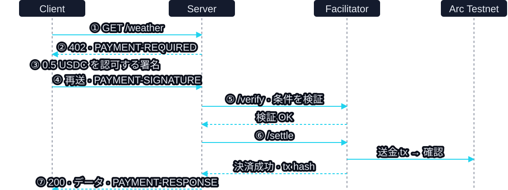

<!-- _class: cover -->
<!-- _paginate: false -->

<span class="tag">Devcon 8 Workshop</span>

# x402 で AI エージェントに<br>お財布を持たせよう

<span class="mute">Autonomous Micropayments with Cloudflare Workers</span>

<!-- 英訳タイトル: Building an x402-Powered AI Agent: Autonomous Micropayments with Cloudflare Workers -->

---

# まず、完成した姿を見よう！

<div class="big cy">Claude Code → 有料 API</div>

- 人間がログインし、`/usage` の予算を承認する
- エージェントが支払いとデータ取得を実行する
- 署名上限を超える決済は拒否される

<!-- 0:00〜1:00。準備済みウォレットで /usage?units=3 の成功と /usage?units=10 の拒否を実演。ログインを冒頭からやり直さない。録画バックアップを用意する。上限は0.5 USDC、成功時の決済は0.3 USDC。 -->

---

# HARUKI

- 日本のエンジニア・UNCHAIN コミュニティ運営
- AWS Community Builder
- 今日は決済の仕組みを CLI で作り、Claude Code につなぐ

<!-- 自己紹介までで2分。参加者の成果はCLIでの決済・拒否の確認。MCPは準備済み参加者が接続し、全員が講師デモで確認する。 -->

---

# 有料 API を使うたび、契約する？

<div class="cols">
<div class="card">
<h3>従来の導入</h3>
<p>API ごとに契約・キー発行・課金設定</p>
<p>エージェントの利用開始にも人間の準備が必要</p>
</div>
<div class="card">
<h3>x402</h3>
<p>402 で価格と支払い条件を受け取る</p>
<p>ウォレットで支払い、有料データを取得</p>
</div>
</div>

<p>有料 API 側の契約・API キーを省ける。今回はウォレット認証に Privy を使う</p>

<!-- 歴史: Coinbase発表は2025-05-06。CloudflareとのFoundation設立計画発表は2025-09-23。 https://www.coinbase.com/en-in/developer-platform/discover/launches/x402 https://www.cloudflare.com/press/press-releases/2025/cloudflare-and-coinbase-will-launch-x402-foundation/ -->

---

<!-- _class: diagram -->

# 署名した条件で、支払いを実行する



<!-- /weather (exact) のフロー。クライアントはCLIまたはMCP内の支払いクライアント。verifyは署名・金額・宛先など支払い条件を検証し、送金完了ではない。Server→Facilitatorのsettleと確認済み結果を追う。uptoのapproveは別のオンチェーン操作。v2ヘッダーはPAYMENT-REQUIRED / PAYMENT-SIGNATURE / PAYMENT-RESPONSE。 https://docs.x402.org/core-concepts/facilitator -->

---

# 実習は CLI、最後に AI へつなぐ

| 役割 | 今回の担当 |
|---|---|
| Client | CLI は秘密鍵＋viem、MCP は Privy ウォレット |
| Server | Hono の有料 API。決済を Facilitator に依頼 |
| Facilitator | 支払い条件の検証・決済 tx の送信 |
| Chain | Arc Testnet。決済とガスに USDC を使う |

<!-- 4役。Facilitatorは今回採用する構成でありx402の必須サービスではない。MCPのウォレットはユーザー所有。CLIのウォレットとは別なので入金先も別。Facilitatorが決済txのガスを負担するが、クライアントのapproveには支払者のガス資金が必要。 -->

---

# 固定額と、上限つきの決済

<div class="cols">
<div class="card">
<h3>/weather · exact</h3>
<p>毎回 0.5 USDC を認可し、決済</p>
<p>今回の USDC は EIP-3009 を使う</p>
</div>
<div class="card">
<h3>/usage · upto</h3>
<p>最大 0.5 USDC を Permit2 署名で認可</p>
<p>3 units × 0.1 = 0.3 USDC を決済</p>
</div>
</div>

<p>このサンプルの units は入力値。実際の使用量を計測する実装ではない</p>

<!-- https://docs.x402.org/schemes/upto 。署名上限は1リクエストごと。uptoでも上限超過の値をあえてsettlement overrideに渡し、拒否されることを検証する。 -->

---

# 何の上限かを区別しよう

| 制限 | 対象・今回の値 |
|---|---|
| クライアントの署名前チェック | 1 回の要求額。通常 1 USDC 以下 |
| Permit2 の署名上限 | `/usage` の 1 回の決済。0.5 USDC 以下 |
| Permit2 への allowance | `/usage` の累積決済。実習では 2 USDC |

<p><strong>/weather とガス代は、Permit2 の予算に含まれない</strong></p>

<!-- allowanceは残高ではない。approveは残りの承認額を設定し直す操作で、入金でも生涯支出制限でもない。MCPの予算承認は人間に確認する指示とconfirm引数により運用し、独立した人間承認の証明を検証する実装ではない。 -->

---

# 今日はローカルで動かす

- Facilitator と Server を Node で起動する
- MCP は Claude Code から起動する
- 完了後、3 サービスを Workers にデプロイできる

<p class="mute">共通のアプリ処理を使い、起動方法・設定・保存先は環境ごとに切り替える</p>

<!-- ここまで10分。Workersデプロイは任意。Cloudflareアカウントはローカル実習には不要。接続確認・デプロイはREADMEとdocs/cloudflare-deploy.mdへ。 -->

---

<!-- _class: section -->

# まず README を開こう

[github.com/mashharuki/Arc-x402-sample#workshop-guide](https://github.com/mashharuki/Arc-x402-sample#workshop-guide)

<p>10〜35 分：Step 0〜3<br>35〜45 分：MCP 接続・講師デモ<br>45〜50 分：質疑と次の一歩</p>

<!-- 手順はREADME。各Stepの終了時に到達確認。15分で無料取得、25分で決済、35分で3 PASSを目安にする。5分以上遅れた参加者は詳細調査をサポートに回し、デモを一緒に確認できるよう案内する。 -->

---

<span class="tag">Step 0 · 10〜15 分</span>

# ファイル作成より、準備完了を確認

```bash
pnpm i && pnpm run setup
```

- `pkgs/config/.env` の `PAYEE_ADDRESS` を設定
- client・facilitator の鍵と接続 URL を確認
- 支払者は 2 USDC 以上＋ガス分、Facilitator はガス分を用意

<p class="mute">setup は既存設定を保持。MCP の準備は README の専用セクションへ</p>

<!-- 未取得なら最初に git clone https://github.com/mashharuki/Arc-x402-sample.git / cd Arc-x402-sample 。Node.js 20+ / pnpm。clientはPAYWALL_PATH=/weather、PAYWALL_API_BASE_URL=http://localhost:4021。facilitatorは別のテスト用秘密鍵。Circle faucetで各公開アドレスに入金する。setupだけでは値は記入されない。秘密鍵を画面共有しない。 -->

---

<span class="tag">Step 1 · 15 分まで</span>

# まずは、支払わずに取得

`pkgs/server/src/app.ts` の STEP 2 ブロックをコメントアウト

```bash
# ターミナル A：起動したままにする
pnpm x402server run dev
# ターミナル B：リクエストを送る
curl -i http://localhost:4021/weather
```

<p><strong>合格：HTTP 200 と天気データ。支払いは発生しない</strong></p>

<!-- ターミナルA/Bは別々。configの受取先などはミドルウェアを外しても必要。接続できないときはAの起動ログ、ポート4021を確認。 -->

---

<span class="tag">Step 2 · 15〜25 分</span>

# 課金を有効にすると、402 が返る

```bash
# ターミナル C：起動したままにする
pnpm facilitator run dev
# ターミナル B：起動確認
curl http://localhost:4022/supported
```

STEP 2 ブロックを戻し、ターミナル A の Server を再起動

```bash
curl -i http://localhost:4021/weather
```

<!-- 合格は次ページ。AはCtrl-C後 pnpm x402server run dev。Cを先に起動する。watchで再起動済みでもsupported取得後の初期化が正常か確認する。 -->

---

# 価格を見てから、支払ってみよう

- 生のレスポンス：`402` と `PAYMENT-REQUIRED`
- 支払い条件：`exact` / `0.5 USDC` / 設定した宛先

```bash
# ターミナル B：署名と再リクエストを自動実行
pnpm x402client run dev
```

<p><strong>合格：Payment settled の success: true・tx hash と天気データ</strong></p>

<!-- PAYMENT-REQUIREDはBase64 JSON。デコード方法はREADMEへ。CLIのPAYWALL_PATH=/weatherを確認。送信ヘッダーはPAYMENT-SIGNATURE、結果はPAYMENT-RESPONSE。天気は固定データ。tx hashをExplorerで確認する。ここを25分までに通過する。 -->

---

<span class="tag am">Step 3 · 25〜35 分</span>

# /usage の予算を設定しよう

```bash
# ターミナル B：現在の allowance を確認
pnpm x402client run approve
# 2 USDC の allowance に設定する
pnpm x402client run approve 2000000 --execute
```

- `status : success` が予算承認の成功条件
- 承認は入金ではない。残高とガス資金も必要
- `/weather` はこの予算を消費しない

<!-- 1000000 atomic units = 1 USDC。approveはクライアント自身が送信するオンチェーン操作。送金済み累計ではなく残りのallowanceを設定し直す。総予算の枯渇確認は補足へ。 -->

---

# 3 ケースとも PASS なら成功！

```bash
pnpm x402client run guardrails
```

| ケース | 期待結果 |
|---|---|
| 署名上限 0.5、請求 0.3 USDC | 決済成功。0.3 USDC が移動 |
| 署名上限 0.5、請求 1.0 USDC | 決済拒否。送金 tx なし |
| client 上限 0.1、要求上限 0.5 USDC | 署名前に拒否 |

<p><strong>summary が 3 件とも PASS。2 USDC の予算枯渇は別の検証</strong></p>

<!-- 第二ケースはinvalid_upto_evm_payload_settlement_exceeds_amount、transactionが空。412などallowance不足で失敗したケースを署名上限の成功と取り違えない。スクリプト全体では0.3 USDCの成功決済がある。ここを35分までに通過する。 -->

---

# 詰まったら、失敗した段階を見る

| 症状 | 最初に確認 |
|---|---|
| 接続できない / 500 | 起動ログ、4022 → 4021 の起動順 |
| 残高・allowance 不足 | 支払者残高、approve の成功 |
| 署名を検証できない | チェーン・トークン・署名ドメイン |

<p>詳細は README「How to work」「Guardrails」。手を挙げてください</p>

<!-- 署名エラーはTOKEN_NAME / TOKEN_VERSION / TOKEN_DECIMALSを含むconfigとネットワークを確認する。stdout全体や秘密鍵を共有させず、エラー理由と失敗段階を確認する。 -->

---

# 35 分地点：CLI から AI へ

- Step 3 完了：MCP 接続に進む
- 途中の人：講師デモで成功・拒否を確認する
- 接続済みの人：支払い前後の残高・allowance を比較する

[README：MCP 接続手順](https://github.com/mashharuki/Arc-x402-sample#mcp-server-for-claude-code-privy-user-owned-wallet)

<!-- 35〜45分。CLIが未完了ならサポートへ。デモとMCP接続に10分以上使わない。録画で代替可。追加課題のWorkersデプロイと別チェーン移植はセッション後の課題へ。 -->

---

# Claude Code にツールを接続しよう

```bash
# リポジトリのルートで実行
claude mcp add x402-arc-demo -- \
  pnpm --dir "$PWD/pkgs/mcp" exec tsx src/index.ts
```

- Privy の App ID・Secret・Client ID と Allowed origins を事前設定
- Claude Code の `/mcp` で接続を確認し、`wallet_status` を呼ぶ
- CLI と Privy は別ウォレット。Privy 側のアドレスにも入金する

<!-- ローカルはstdio。pnpm run devのバナーをstdoutへ流さない。Claude Code利用環境も事前準備に含める。MCP起動が失敗→設定不足・絶対パス、認証エラー→Allowed origins、署名エラー→configのPAYEE_ADDRESS/チェーン/トークンを確認。既存の同名登録がある参加者は再登録せず/mcpで再接続。 -->

---

# 人間が許可し、エージェントが支払う

| 人間が行うこと | エージェントが行うこと |
|---|---|
| メール認証とウォレットへの入金 | 状態を確認し、支払いツールを呼ぶ |
| `/usage` の予算額を確認・承認 | 条件内で署名し、有料データを取得 |

<p>確認する結果：<strong>0.3 USDC の成功と、1.0 USDC の拒否</strong></p>

<p class="mute">予算承認の確認は MCP の指示と confirm 引数で運用する</p>

<!-- README「Try every tool in one prompt」のプロンプトを実物のまま使う。今回の署名上限は0.5 USDC。set_budgetはpreview→ユーザーの確認→confirm=true。これは独立した人間承認の証明を検証する仕組みではない。ユーザー所有のPrivyウォレットとポリシー制限された委任署名者を使う。初回認証・faucetが遅ければ準備済みウォレット/録画で実演。45分まで。 -->

---

# 自分の API を、有料にしてみよう

- 固定額なら `exact`、1 回の上限つき課金なら `upto`
- 合格の証拠は決済レシートと、理由を確認できる拒否
- 次は、自分の API に課金ルートを追加する

[Workers へのデプロイ手順](https://github.com/mashharuki/Arc-x402-sample#deploy-to-cloudflare-workers)

<!-- 45〜50分は質疑。Workersへのデプロイ、対応EVMチェーンへの移植、実使用量の計測は追加課題。ガス代やexactを含む全支出の累積制御は別途設計が必要。 -->

---

<!-- _class: cover -->
<!-- _paginate: false -->

# コードと手順は、こちら

[github.com/mashharuki/Arc-x402-sample](https://github.com/mashharuki/Arc-x402-sample)

<span class="mute">HARUKI · UNCHAIN · @haruki_web3</span>

<!-- 本編はここで終了。以下は質疑用の補足。 -->

---

<span class="tag">補足</span>

# AP2・x402・MPP の位置づけ

| プロトコル | 主に扱うこと |
|---|---|
| AP2 | ユーザーの意図・認可を証明し、取引の責任を明確にする |
| x402 | HTTP 402 を使い、支払い条件と決済をやり取りする |
| MPP | HTTP の有料アクセス。カード・ステーブルコイン等へ拡張 |

<p>x402 と MPP は役割が重なり、SDK での連携も可能</p>

<!-- 2026-10-02確認。 https://ap2-protocol.org/ https://mpp.dev/blog/evm-x402-support 。AP2は単に上に積む必須レイヤーではない。MPPのmppxはx402 exactにも対応。登壇前に公式情報を再確認。 -->

---

<span class="tag">補足</span>

# 別の EVM チェーンへ移植するには？

- `pkgs/config/.env` でチェーン・トークン・価格を変更
- 署名ドメイン・decimals・対応コントラクトを確認
- 支払者と Facilitator の資金、MCP ポリシーも確認

[README：共有設定の変更](https://github.com/mashharuki/Arc-x402-sample#switch-chain-token-or-price)

<!-- RPC/chain ID/アドレスの差し替えだけではない。Permit2/upto proxyとEIP-3009など方式の対応、単位変更時のatomic上限値、既存Privyウォレットのポリシー更新も確認する。Workersは設定を反映して再デプロイする。 -->

---

<span class="tag">補足</span>

# 予算がないときも、拒否される？

```bash
# /usage の allowance を 0 にする
pnpm x402client run approve 0 --execute
pnpm x402client run guardrails
# 検証後、2 USDC に戻す
pnpm x402client run approve 2000000 --execute
```

<p>上限内ケースも失敗する。拒否理由を確認し、3 PASS の検証と区別する</p>

<!-- allowance不足の拒否を確認する追加課題。通常のguardrails合格条件を満たす実行ではない。実際に2 USDCを使い切る検証でもない。approve自体はガスを消費。 -->
