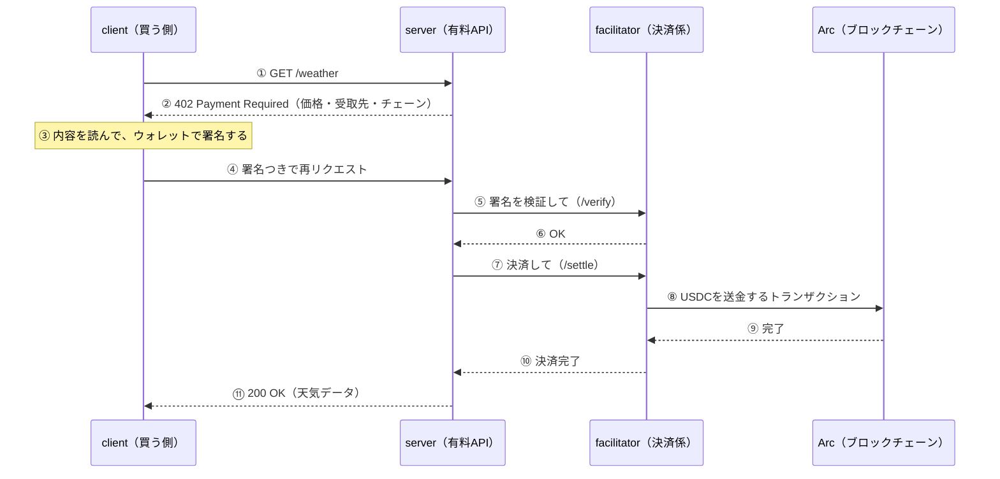

# x402 × Arc ハンズオン：Cloudflare Workersで作る、自然言語で動くAIエージェント決済

## このワークショップで作るもの

**「AIエージェントに、自然言語で『この有料APIを使って』と頼むと、自動で代金を支払ってデータを取ってきてくれる」仕組み**を、自分の手で作ります。

使う技術は次の通りです。

| 技術 | 役割 |
|---|---|
| **x402** | HTTPの`402 Payment Required`を使った、APIの支払いプロトコル |
| **Arc（テストネット）** | 決済に使うブロックチェーン。ガス代も決済もUSDCで払う |
| **Privy** | AIエージェント用のウォレットを、メールログインで作る |
| **Cloudflare Workers** | 3つのサーバーを動かす場所 |
| **MCP** | Claude CodeなどのAIエージェントから、ウォレットや支払いを呼び出す仕組み |

作るものは、次の**4つのプログラム**です。

| 名前 | 役割 |
|---|---|
| **server** | 有料API（天気データなど）。未払いなら「402：お金を払って」と返す |
| **facilitator** | 支払いが正しいか検証し、ブロックチェーンに記録（決済）する係 |
| **client** | 402を受けたら署名して支払い、もう一度APIを呼ぶ（ローカル確認用） |
| **mcp** | AIエージェントから自然言語で支払いを実行するための窓口。ウォレットも管理する |

> 💡 serverは「商品を売る店」、facilitatorは「決済端末とレジ担当」、clientは「買う人」、mcpは「買い物を代行するAIエージェント」と考えると分かりやすいです。

### 進め方

先にローカルでx402の流れを理解してから、同じものをクラウドに載せ、最後にAIエージェントから使います。

| ステップ | やること | 目的 | 時間の目安 |
|---|---|---|---|
| 1. セットアップ | 依存関係の導入、設定ファイルの作成 | 動かす準備をする | 15分 |
| 2. ローカルで確認 | 3つのプログラムをPCで動かし、支払いを体験 | x402の仕組みを手元で理解する | 30分 |
| 3. デプロイ | 3つのプログラムをCloudflare Workersに載せる | 誰でも使える公開サーバーにする | 30分 |
| 4. 自然言語で決済 | Claude Codeから、MCP経由で支払う | AIエージェントに安全にお金を扱わせる | 20分 |
| 5. 後片付け | デプロイしたリソースを削除 | 課金や管理の手間を残さない | 5分 |

> ※時間の目安は、環境や会場のネットワーク状況で前後します。

使うブロックチェーンは **Arc**のテストネット（本物のお金は使いません）、ウォレットには**Privy**を使います。**Claude Code**を使って進めますが、MCP（Streamable HTTP）に対応した**Codex**などのAIエージェントでも、同じURLを登録すれば使えます。

## x402とは？（先に読んでおきましょう）

x402は、HTTPに最初から用意されていたものの、ほとんど使われてこなかった**`402 Payment Required`**というステータスコードを使って、**APIのアクセス権をその場で支払う**ためのプロトコルです。会員登録やAPIキーの発行が要らず、人間だけでなく**AIエージェントも自動で**支払えます。

支払いの流れは次の通りです。



ポイントは3つです。

- **serverはブロックチェーンに触れません**。検証と決済はfacilitatorに任せます。
- **clientは「署名」するだけ**です。署名で「この金額までなら払ってよい」と認可します。
- 価格や条件は**402のレスポンスに書いてある**ので、事前の契約や登録なしに、その場で支払い方法が分かります。

このワークショップでは、この流れを**ローカルで体験 → クラウドに載せる → AIエージェントに任せる**の順に確認します。

## このワークショップで得られること

このワークショップの内容を最後まで実践することであなたは以下のことを理解することができます。

- x402スキーム
- Cloudflare Workersにx402スキームに必要なリソースをデプロイする方法
- 任意のチェーン・アセットを設定する方法
  - 今回のワークショップではArcテストネットのUSDCを使いますが、他のチェーンやアセットを設定する方法もコードを見れば理解できるようになっています。
- 自然言語でx402決済を実現させる方法

## 前提条件

- VS Codeなどエディターをインストール済みであること
- Claude CodeのProプラン以上を契約していること
- Git がインストール済みであること
- GitHubアカウントが作成済みであること
- Privyのアカウントを作成済みで、Appを作成し**Emailログインを有効**にしていること
- Cloudflareのアカウントを作成済みであること（無料のWorkers Freeプランで可）
- Node.js **v22以上**およびpnpmをインストール済みであること（Workersのデプロイに使うwranglerがNode 22以上を要求します）
- MetaMaskをインストール済みであること（テスト用のウォレットと秘密鍵の取得に使います）
- （講師向け）会場のWi-Fi配下で多くの参加者が同じMCPサーバーを使う場合は、事前にレート制限を調整してください。詳細は「デプロイする」の③mcpの補足を参照

> wrangler CLIのグローバルインストールは不要です。このリポジトリの依存関係として導入され、`pnpm --filter <パッケージ名> exec wrangler`で実行します。

## セットアップ

### 依存関係のインストール

このワークショップのコードは、複数のパッケージ（client / server / facilitator / mcp / config）をまとめたpnpmワークスペースです。まず、全パッケージの依存ライブラリを一括でインストールします。プロジェクトのルートで以下を実行してください。

```bash
pnpm install
```

### 環境変数の設定

秘密鍵やURLなどの設定は、コードにベタ書きせず**環境変数用のファイル（`.env`など）**に分けて置きます。まず、各パッケージ用のテンプレート（`*.example`）を複製して、自分用のファイルを作ります。

```bash
pnpm run setup
```

このコマンドにより、以下の8つの環境変数用のファイルが作成されます。

```bash
pkgs/client/.env
pkgs/server/.env
pkgs/server/.dev.vars
pkgs/facilitator/.env
pkgs/facilitator/.dev.vars
pkgs/mcp/.env
pkgs/mcp/.dev.vars
pkgs/config/.env
```

### 設定がうまく適用されているかどうかチェックする

ここまでの準備が正しいか、次に進む前に確認します。全パッケージの型チェックが通れば、依存関係とセットアップは問題ありません。

```bash
pnpm -r run cf:typecheck
```

エラーなく全てのパッケージが完了すれば準備OKです！

> 💡 初回クローン直後に`pnpm run -r build`は使わないでください。server / mcpのビルドが、`wrangler types`で生成するファイルを必要とするため失敗します。`cf:typecheck`は生成から型チェックまでをまとめて行います。

## ローカルでの確認手順

**この章のゴール：自分のPCでx402の支払いの流れ（402 → 署名 → 決済）を体験すること**です。

いきなりクラウドに載せると、うまくいかないときに原因が分かりにくくなります。そこで、まずはローカルで3つの要素（**client / server / facilitator**）を動かして、流れを理解します。

| 要素 | 役割 | ポート |
|---|---|---|
| facilitator | 支払いの検証（verify）とオンチェーンでの決済（settle）を行う | 4022 |
| server | 有料API（`/weather` など）を提供し、未払いなら402を返す | 4021 |
| client | 402を受け取ると署名して支払い、リトライする | - |

### 1. 環境変数に値を入れる

このあと実際にブロックチェーン上で送金するため、**支払う人・決済を実行する人・受け取る人**のアドレスが必要です。`pnpm run setup` で作成された`.env`に、以下の値を入れてください。

| ファイル | 変数 | 内容 |
|---|---|---|
| `pkgs/config/.env` | `PAYEE_ADDRESS` | 支払いの受取先アドレス（あなたのウォレットアドレス） |
| `pkgs/facilitator/.env` | `EVM_PRIVATE_KEY` | 決済トランザクションを送るウォレットの秘密鍵（ガス代を払う） |
| `pkgs/client/.env` | `EVM_PRIVATE_KEY` | 支払い側のウォレットの秘密鍵 |

秘密鍵は**MetaMask**からコピーして使います。

1. MetaMaskで、このワークショップ専用の**新しいアカウント**を2つ作成します（例：`x402-client`と`x402-facilitator`）
2. 各アカウントで **︙（アカウントの詳細）→ 秘密鍵を表示** を開き、パスワードを入力して秘密鍵をコピーします
3. clientのアカウントの秘密鍵を`pkgs/client/.env`、facilitatorのアカウントの秘密鍵を`pkgs/facilitator/.env`の`EVM_PRIVATE_KEY`に貼り付けます（`0x`から始まる形式にしてください）
4. `PAYEE_ADDRESS`には、受取用のアドレスを設定します。**clientとは別のアドレス**にしてください（同じだと自分宛ての送金になり、残高の変化で決済を確認できません）。MetaMaskにもう1つアカウントを作って、そのアドレスを使うと分かりやすいです

> ⚠️ 秘密鍵は**テスト専用のウォレット**のものを使ってください。メインのウォレットの秘密鍵は絶対に入れないでください。`.env`はGit管理外ですが、チャットなどにも貼らないでください。

チェーンやトークン、価格は`pkgs/config/.env`にまとまっています（デフォルトは**Arc Testnet**のUSDC）。このファイルを書き換えるだけで、他のチェーンやアセットに切り替えられます。

### 2. テストネットUSDCを入手する

支払いにはUSDCが、決済トランザクションの送信にはガス代が必要です。テストネットのUSDCは無料で受け取れます。

[Circle Faucet](https://faucet.circle.com/)で**Arc Testnet**を選び、USDCを受け取ります。

- client（支払い側）のアドレス：最低でも**2 USDC**
- facilitatorのアドレス：ガス代として少額

> ArcではUSDCがガストークンを兼ねているため、別途ガストークンを用意する必要はありません。

### 3. facilitatorとserverを起動する

serverは支払いの検証をfacilitatorに依頼するため、**facilitator → server**の順に起動します。ターミナルを2つ開いてください。

```bash
# ターミナルA
pnpm facilitator run dev
```

```bash
# ターミナルB
pnpm x402server run dev
```

もしくは、以下のコマンドで2つまとめてバックグラウンドで起動できます（ログは`.run/`に出力されます）。

```bash
pnpm start
```

止めるときは`pnpm stop`です。

## 動作確認（ローカル）

### 1. 起動確認

```bash
curl localhost:4022/supported
curl localhost:4021/health
```

`/supported`で、facilitatorが対応している決済方式（`exact`と`upto`）とネットワーク（`eip155:5042002`）が返ってくればOKです。

### 2. 支払い前の状態（HTTP 402）を確認する

まず、お金を払わずに有料APIを呼ぶとどうなるかを見てみます。

```bash
curl -i localhost:4021/weather
```

`HTTP/1.1 402 Payment Required`が返り、`PAYMENT-REQUIRED`ヘッダーに**価格・受取先・チェーン**などの支払い要件がBase64で入っています。clientはこの内容を読んで、その場で支払い方法を知ります。

### 3. clientで支払ってデータを取得する

```bash
pnpm x402client run dev
```

clientを使うと、さきほどの流れ図の③〜⑪を自動で行います（402を受け取る → 署名 → 支払い付きでリトライ → データ取得）。天気データと`Payment settled`（`success: true`とトランザクションハッシュ）が表示されれば成功です🎉

トランザクションは[Arc Testnet Explorer](https://explorer.testnet.arc.io/)で確認できます。

### 4. 使った分だけ払う`upto`スキームを試す

ここまでの`/weather`は、毎回決まった金額を払う**`exact`（固定料金）**でした。`/usage?units=N`は、使ったユニット数に応じた金額だけを決済する**`upto`（従量課金）**のAPIです。clientは「最大でいくらまで」を署名で認可し、serverが実際の利用量分だけを決済します。

AIエージェントに支払いを任せるときは、**使いすぎを防ぐ仕組み**が欠かせません。ここでその仕組みを確認します。

まず、clientの支払い予算（USDCのPermit2へのallowance）を設定します。`--execute`を付けないと現在の値を確認するだけのdry-runになります。

```bash
pnpm x402client run approve 2000000 --execute
```

次に、ガードレールのシナリオを実行します（facilitatorとserverが起動している必要があります）。

```bash
pnpm x402client run guardrails
```

以下の3つのケースが`PASS`になれば成功です。

- 署名した上限の範囲内（0.3 USDC）は決済される
- 署名した上限（0.5 USDC）を超える決済（1.0 USDC）は拒否される
- clientの上限（`MAX_AMOUNT_PER_PAYMENT`）を超える場合は、署名する前に拒否される

AIエージェントにお金を扱わせる場合に重要な「支払いの上限を何重にもかける」考え方を、ここで体験できます。

## Cloudflare Workersにデプロイ

**この章のゴール：ローカルで動かした3つの要素と、AIエージェント用のMCPサーバーを、Cloudflare Workersに公開すること**です。

クラウドに載せることで、PCを閉じていても動き、AIエージェントのMCPクライアントからも接続できる状態になります。

### 1. Cloudflareにログインする

```bash
pnpm --filter facilitator exec wrangler login
pnpm --filter facilitator exec wrangler whoami
```

`wrangler login`でブラウザが開くので、Cloudflareにログインして許可します。`whoami`で、デプロイ先のアカウントが正しいか確認してください。また、[Workers & Pages](https://dash.cloudflare.com/?to=/:account/workers-and-pages)で`workers.dev`のサブドメインが未設定の場合は先に設定しておきます。

### 2. Privyの設定をする

MCPサーバーは、メールログインで**AIエージェント専用のウォレット**を作ります。ウォレットの管理にはPrivyを使うため、先にPrivyの設定を済ませます。[Privy Dashboard](https://dashboard.privy.io)で以下を行います。

1. **Email**ログインを有効にする
2. **App ID**・**App Secret**・**Client ID**を控える
   - `PRIVY_APP_ID`と`PRIVY_CLIENT_ID`は公開してよい値なので`pkgs/mcp/wrangler.jsonc`の`vars`に、`PRIVY_APP_SECRET`は次の手順でsecretに設定します
3. **Allowed origins**に、デプロイ後のmcp Workerのオリジン（例：`https://x402-arc-mcp.<あなたのサブドメイン>.workers.dev`）を追加する
   - mcp WorkerのURLは、デプロイ前でも「Worker名（`x402-arc-mcp`）＋あなたの`workers.dev`サブドメイン」で決まります
   - サブドメインは、[Workers & Pages](https://dash.cloudflare.com/?to=/:account/workers-and-pages)のダッシュボードで確認できます。`pnpm --filter facilitator exec wrangler whoami`でもアカウントの情報を確認できます
   - ローカルで試す場合は`http://localhost:5173`も追加しておきます
   - 登録が必要な理由：Privyは、登録されたオリジン（呼び出し元のURL）以外からのログインを拒否します。登録を忘れると`Origin not allowed`エラーになります

### 3. シークレットを登録する

秘密鍵などの秘密情報は、`wrangler.jsonc`のようなファイルに書くと公開される恐れがあります。そこで、ファイルではなく**Cloudflareの暗号化された保管庫（wranglerのsecret）**に登録します。コマンド実行後に値の入力を求められるので、ご自身で入力してください。

```bash
pnpm --filter facilitator exec wrangler secret put EVM_PRIVATE_KEY
pnpm --filter x402mcp exec wrangler secret put PRIVY_APP_SECRET
```

> ⚠️ `PRIVY_APP_SECRET`はそのアプリの全ユーザーのウォレットを作成できる強い権限を持ちます。他人に渡したり、Gitにコミットしたりしないでください。

初回の`wrangler secret put`では、まだWorkerが存在しないため作成するか聞かれることがあります。その場合は`Y`で進めてください。

### 4. デプロイする（順番が大事です）

serverはfacilitatorのURLを、mcpはserverのURLを設定に持ちます。URLはデプロイしてはじめて分かるため、**facilitator → server → mcp**の順にデプロイします。

> ⚠️ `pkgs/server/wrangler.jsonc`と`pkgs/mcp/wrangler.jsonc`の`<...>`の部分は、**すべてご自身の値に書き換えてください**。`<...>`が残ったままでもデプロイ自体は通りますが、Workerが正しく動きません。デプロイ前に、次のコマンドで`<`が残っていないか確認できます（何も表示されなければOKです）。
>
> ```bash
> grep -n "<" pkgs/server/wrangler.jsonc pkgs/mcp/wrangler.jsonc | grep -v '\$schema'
> ```

**① facilitator**

```bash
pnpm deploy:facilitator
```

出力された`https://x402-arc-facilitator.<サブドメイン>.workers.dev`のURLを控えます。

**② server**

`pkgs/server/wrangler.jsonc`の`FACILITATOR_URL`を、①のURLに書き換えてからデプロイします。

```jsonc
"vars": {
  "FACILITATOR_URL": "https://x402-arc-facilitator.<サブドメイン>.workers.dev"
}
```

```bash
pnpm deploy:server
```

**③ mcp**

`pkgs/mcp/wrangler.jsonc`の以下の値を書き換えてからデプロイします。

```jsonc
"vars": {
  "PAYWALL_API_BASE_URL": "https://x402-arc-server.<サブドメイン>.workers.dev", // ②のURL
  "PRIVY_APP_ID": "<あなたのApp ID>",
  "PRIVY_CLIENT_ID": "<あなたのClient ID>",
  "PRIVY_ORIGIN": "https://x402-arc-mcp.<サブドメイン>.workers.dev" // このmcp WorkerのURL
}
```

```bash
pnpm deploy:mcp
```

> 💡 **レート制限（講師向け）**：`pkgs/mcp/wrangler.jsonc`の`ratelimits`は、既定で「同一クライアントIPあたり300リクエスト/60秒」です。会場のWi-Fi配下では参加者全員が同じIPに見えるため、1つの枠を共有して誤って429になることがあります。1人あたり約10〜15リクエスト使う想定で、`simple.limit`を「参加者数 × 15」以上に引き上げてください（例：50人なら750以上。`period`は10か60のみ）。また`namespace_id`（既定`"4021"`）はCloudflareアカウント内で一意にしてください。

> 💡 必ず`pnpm deploy:*`を使ってください。`wrangler deploy`を直接実行すると、`pkgs/config/.env`の共有設定（チェーン・トークン・価格など）がWorkerに渡らず、Workerが500エラーを返します。

## 動作確認（デプロイ後）

### 1. facilitatorとserverの確認

```bash
curl -s https://<facilitatorのURL>/supported
curl -s https://<serverのURL>/health
curl -s -i https://<serverのURL>/weather
```

ローカルのときと同じように、`/supported`が返り、`/weather`が`402`になればデプロイ成功です。

### 2. MCPサーバーをClaude Codeに登録する

```bash
claude mcp add --transport http x402-arc-remote https://<mcpのURL>/mcp
```

登録後、Claude Codeで`/mcp`を実行して接続状態を確認してください。

### 3. 自然言語でx402決済を実行する

MCPサーバーを登録すると、Claude Codeは次のツールを使えるようになります。ウォレットの作成から支払いまで、すべて自然言語の指示だけで進められます。

| ツール | 内容 |
|---|---|
| `wallet_status` | ウォレットの有無・残高・allowanceの確認 |
| `wallet_login_start` / `wallet_login_verify` | メールのワンタイムコードでログインし、Privyのウォレットを作成 |
| `set_budget` | 支払い予算（allowance）の設定。**金額の確認（confirm）を挟む2ステップ** |
| `pay_and_fetch` | 有料APIにアクセスして支払う（`/weather`と`/usage?units=N`のみ許可） |

Claude Codeに、以下のように話しかけてみましょう。

> ウォレットの状態を確認して。まだ無ければ、メールでログインしてウォレットを作るところまで案内して。

ウォレットが作られたら、表示されたアドレスに[Circle Faucet](https://faucet.circle.com/)で**Arc Testnet**のUSDCを入金し、続けて以下を依頼します。

> 予算を2 USDCに設定して（金額は私に確認してから実行して）。そのあと以下を順番にやって、それぞれ結果を教えて。
> 1. `/weather`を支払って取得（exact、0.5 USDC）
> 2. `/usage?units=3`を支払って取得（upto、0.3 USDC）
> 3. `/usage?units=10`を支払って取得（uptoで1.0 USDC。署名した上限0.5 USDCを超えるのでどうなる？）

期待される結果は以下の通りです。

- 1と2：決済が成功する
- 3：facilitatorが`invalid_upto_evm_payload_settlement_exceeds_amount`で拒否し、**課金されない**

> 💡 3の拒否は、失敗ではなく**ガードレールが正しく働いた結果**です。ローカルで体験した「上限を超える決済は通らない」仕組みが、AIエージェント経由でも効いていることを確認できます。

> 💡 予算の承認（`set_budget`）だけは人間が確認する設計です。AIエージェントが自分で支払い上限を引き上げることはできません。一度予算を承認すれば、あとは上限の範囲内でエージェントが自律的に支払えます。これが「AIエージェントに安全にお金を扱わせる」ための仕組みです。

### うまくいかないとき

| 症状 | 確認すること |
|---|---|
| `wallet_login_start`が`Origin not allowed`で失敗 | Privy Dashboardの**Allowed origins**にmcp WorkerのURLを登録したか |
| `wallet_login_start`が`Must specify origin`で失敗 | `PRIVY_ORIGIN`を設定してmcpを再デプロイしたか |
| Workerが変数名つきの500エラーを返す | `wrangler deploy`を直接実行していないか（`pnpm deploy:*`を使う） |
| serverからfacilitatorへのリクエストが失敗する（Cloudflareエラー1042） | `wrangler.jsonc`の`compatibility_flags`に`global_fetch_strictly_public`があるか |
| `wallet_status`で`rate limit exceeded` | ArcのパブリックRPCの制限です。数秒待って再実行してください |
| `invalid_exact_evm_insufficient_balance` | 支払い側ウォレットのUSDC残高が不足しています。Faucetで補充してください |

ログは以下で確認できます。

```bash
pnpm --filter <パッケージ名> exec wrangler tail
```

## 後片付け

検証が終わったら、課金や管理の手間を残さないよう、以下を行ってください。

### 1. ローカルのサーバーを止める

`pnpm start`で起動した場合は、次のコマンドで止めます。ターミナルで直接起動した場合は`Ctrl+C`で止めてください。

```bash
pnpm stop
```

### 2. Claude CodeからMCPサーバーの登録を外す

```bash
claude mcp remove x402-arc-remote
```

### 3. デプロイしたWorkerを削除する

```bash
pnpm --filter facilitator exec wrangler delete
pnpm --filter x402server exec wrangler delete
pnpm --filter x402mcp exec wrangler delete
```

それぞれ確認のプロンプトが表示されるので、内容を確認して進めてください。正常に完了すれば、Workerとそこに登録したsecretが**Cloudflare Workers**から削除されます。

### 4. 秘密情報と残りの資金を整理する

- `pkgs/*/.env`に貼ったテスト用の秘密鍵は、不要になったら削除してください。MetaMaskの専用アカウントも、使い終わったら使わないようにしてください
- Privy Dashboardで登録した**Allowed origins**から、このワークショップ用のURLを削除してください
- 他の用途にも使っているPrivyのAppを使った場合は、**App Secretを再発行（ローテーション）**しておくと安心です
- テストネットのUSDCは価値がないため、そのままで構いません

## まとめ

以上でワークショップは終わりです！

おめでとうございます🥳！！

これでx402スキームを実現するための最小限のソースコードをCloudflare Workersにデプロイして動かす方法を学びました。

次はこのコードをベースにあなただけのオリジナルなアプリの開発に繋げてください！！

このワークショップを受講していただき本当にありがとうございました！！

Haruki

## 参考リンク

- [このワークショップのリポジトリ](https://github.com/mashharuki/Arc-x402-sample)
- [x402 公式サイト](https://www.x402.org/)
- [x402 ドキュメント](https://docs.x402.org/)
- [Arc（Circle）](https://docs.arc.io/arc-chain)
- [Circle Faucet](https://faucet.circle.com/)
- [Arc Testnet Explorer](https://explorer.testnet.arc.io/)
- [Privy Dashboard](https://dashboard.privy.io)
- [Cloudflare Workers ドキュメント](https://developers.cloudflare.com/workers/)
- [Cloudflare Workers デプロイ手順（詳細版）](./cloudflare-deploy.md)
